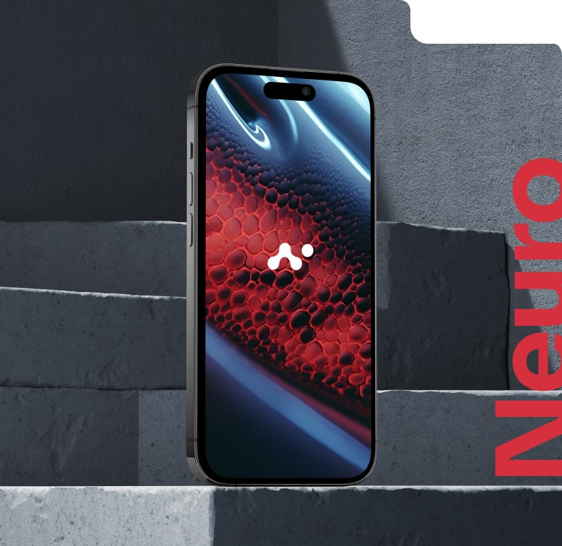

## Future-Proof Your Business with Scalable, Secure Cloud Services

Seamlessly migrate, manage, and optimize your operations in the cloud with our end-to-end cloud solutions.

[Click here](#) [Click here](#) 

###### Well  
Established

Cool Number 0 Cool Number 0

Bespoke software, cloud systems, and BI tools crafted for healthcare compliance, construction timelines, or legal confidentiality.  

Modular IT solutions for small/midsize businesses—flexible enough for startups, robust enough for enterprises.  

Uptime 0 /7

Powered by

We serve 200+ organizations across 10 sectors, see what they have to say:

"Knowledgeable and efficient IT professionals, they responded and resolved the issue."

"Great company, excellent white-glove service, classy leadership. Especially enjoy working with Oscar and Dung; they've taken great care of us over the years! Five stars!"

"Ryan and everyone from Blackline are very professional, empathetic, and kind. Whenever we have an issue, they are so prompt to respond and take care of the issue. I enjoy speaking with them whenever I am in need!"

"A great company to work with. We have partnered with them for almost 15 years now."

"Their programmers are easy to talk to and they are always available to chat. High quality work at a fair price."

"What took hours with the previous IT support firm waiting for a response now takes minutes and can usually be fixed in a very short timeframe. My team is blown away by the amount of attention our account receives, and we enjoy working with our Blackline support team. This is a shout out and thank you to Jake, and Zeke!"

"Have been a customer of Blackline for about 8 years and we have received nothing but excellent service and sound advice regarding our IT needs. As a smaller company with multiple branches, Blackline's service model has worked well for us."

"Blackline is a great IT Support company. Quick responses & resolutions. Isaac, Oscar & Joe are great! I would recommend them 100%"

"Blackline is always prompt, professional, and quick to resolve every IT issue that might impede my productivity."

"While IT issues can be frustrating and stressful, Blackline makes it easy and even enjoyable. Dung, Gus and Ryan are professional, friendly and always get things taken care of right away. I am so happy our company decided to go with Blackline and would highly recommend them for any and all IT support"

"Blackline runs IT for our medical practice and is great, even for urgent or more complex issues."

"I've been consistently impressed with the team at Blackline. Even when I had the brilliant idea of deleting my entire website, without realizing that (of course) that would mean I no longer have email. Solved same day, as are most of the requests we have for their team. Highly responsive, and there was no audible laughing as I described my email emergency. Very professional team and very easy to work with."

"Quick to respond....Highly professional."

### A strategic cloud journey from assessment to optimization—designing tailored architectures, executing seamless migrations, and delivering continuous management for performance and ROI.

What platforms do you support?

We specialize in Microsoft Azure, AWS, and hybrid cloud environments, with experience in SaaS, PaaS, and IaaS.

How secure is your cloud solution?

We follow the latest cloud security best practices, including 24/7 monitoring, encryption, access control, and full compliance.

Can you help reduce my current cloud costs?

Absolutely. Through cloud optimization and cost management, our clients typically see savings of 25–40%.

Do you offer local support?

Yes, we serve businesses across Chicago, Naperville, and surrounding regions with hands-on support.

Schedule a free cloud assessment with one of our certified consultants. You’ll receive a tailored roadmap to reduce costs, improve security, and scale faster.

[(630) 388-1700](https://www.google.com/search?q=blacklineit&sca_esv=3cbb991dc4cf362e&sxsrf=AHTn8zr93oVBGw8uyIRQKVxaNC9xrX0emw%3A1741804262300&source=hp&ei=5tLRZ83mD6fnwN4PtpnamAE&iflsig=ACkRmUkAAAAAZ9Hg9tzkHiXLfsrTjDrX-farvUN7sEO5&ved=0ahUKEwjN8cfCloWMAxWnM9AFHbaMFhMQ4dUDCBo&uact=5&oq=blacklineit&gs_lp=Egdnd3Mtd2l6GgIYAiILYmxhY2tsaW5laXQyCxAuGIAEGMcBGK8BMgUQABjvBTIFEAAY7wUyCBAAGIAEGKIESO0eUI8DWN8dcAR4AJABAJgBggKgAbMSqgEFMy41Lja4AQPIAQD4AQGYAhKgAuISqAIKwgIHECMYJxjqAsICDhAuGIAEGLEDGNEDGMcBwgIFEAAYgATCAgsQABiABBixAxiDAcICCBAAGIAEGLEDwgIOEAAYgAQYsQMYgwEYigXCAgsQLhiABBjRAxjHAcICChAjGIAEGCcYigXCAhMQLhiABBjHARgnGIoFGI4FGK8BwgIQEC4YgAQY0QMYxwEYJxiKBcICCxAAGIAEGJECGIoFwgIaEC4YgAQYsQMY0QMY0gMYgwEYxwEYqAMYiwPCAhcQLhiABBixAxjRAxjSAxjHARioAxiLA8ICCBAuGIAEGLEDwgIUEC4YgAQYpgMYxwEYqAMYiwMYrwHCAggQABiABBiLA8ICBxAAGIAEGArCAhQQLhiABBjRAxjSAxjHARioAxiLA8ICDhAuGIAEGMcBGI4FGK8BwgIOEC4YgAQYsQMYgwEYigXCAgUQLhiABMICDhAAGIAEGJECGLEDGIoFwgIREC4YgAQYsQMY0QMYgwEYxwHCAgsQABiABBixAxiLA8ICBxAuGIAEGArCAggQABiiBBiJBZgDA_EF7orAlmDePwSSBwU1LjcuNqAHw7MB&sclient=gws-wiz#)

[Facebook-f](https://www.facebook.com/blacklineit/) [X-twitter](https://x.com/BlacklineIT) [Linkedin-in](https://www.linkedin.com/company/blacklineit) [Instagram](https://www.instagram.com/blacklineit)

[1751 W Diehl Rd  
Suite 185 Naperville, IL](https://g.co/kgs/kmi23bK)

[171 N Aberdeen St  
Suite 400 Chicago, IL  
](https://g.co/kgs/d5JJwPK)

## Get in Touch

Full Name(Required)  First

Email(Required)  Message(Required)Please let us know what's on your mind. Have a question for us? Ask away.
