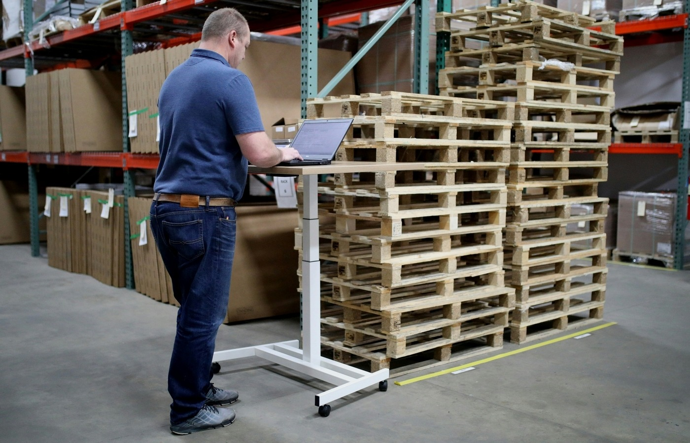
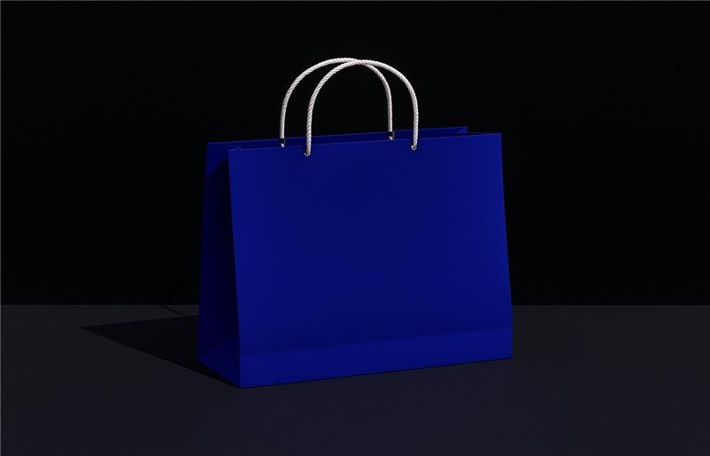

Company:

End Users:

Industry:

Get actionable insights on your IT strategy at no cost and no contracts, just free value.

[Schedule](https://blacklineit.com/contact/)

### Doubling E-Commerce Revenue Through Tech Modernization

Craig Bachman Imports (CBI), a nationally recognized wholesale distributor of craft and seasonal décor, relies on technology to drive warehousing, distribution, ERP systems, and e-commerce operations. With a flagship hub in Dallas and a team of 75–100 employees, the company’s success hinges on consistent uptime—especially during seasonal peaks, when every hour of productivity matters.

However, persistent IT instability, misaligned systems, and fragmented internal capabilities brought CBI to a crossroads. Digital stagnation, recurring outages, and operational inefficiencies were placing growth—and customer trust—at serious risk.

### **The Problem**

Before turning to Blackline, CBI was entangled in critical IT challenges. System outages and infrastructure failures frequently disrupted operations—especially problematic during holiday surges. Their ERP system, critical for inventory, ordering, and finance, was poorly configured, causing workflow delays and interdepartmental confusion.

Technology management was chaotic. High IT staff turnover had left behind a void of documentation and a lack of strategic continuity. Key best practices in security, backup, and monitoring were virtually non-existent.

 

**Core Risks Identified:**

- Frequent downtime jeopardizing warehouse, fulfillment, and seasonal delivery cycles
- A broken ERP system obstructing operational flow and order visibility
- A lack of IT governance creating security, continuity, and compliance concerns
- Internal teams stretched thin, unable to manage or modernize essential technology

CBI realized they needed more than a vendor—they needed a strategic partner who could stabilize operations, align technology with their growth objectives, and unlock digital potential. That’s when Blackline stepped in.

### **How We Solved It**

Blackline assumed full ownership of CBI’s IT ecosystem, transforming from a managed services provider to a true strategic partner. We made the core systems more reliable, set up regular updates and backups, and added tools to spot and fix problems quickly.

The ERP platform was realigned to fit real-world workflows—eliminating bottlenecks and enhancing data accuracy across purchasing, inventory, and customer service operations.

We then tackled the e-commerce challenge head-on. Previously, the website was outdated and sluggish, pulling real-time data directly from the ERP, which caused system overloads. The self-hosted nature of the site meant internet outages at the Dallas HQ—frequent before our intervention—would knock it offline completely. As a result, most customers bypassed the website altogether in favor of phone orders and physical catalogs.

Inspired by consumer-grade digital experiences like Amazon, we rebuilt the platform for speed, stability, and usability. Customers could now:

- See clear distinctions between “in-stock” and pre-order items
- Place valid orders more frequently without guessing seasonal needs months in advance
- Trust inventory and pricing accuracy in real-time

The new architecture decoupled the front-end experience from the ERP, ensuring the system remained performant and resilient even under high demand. The impact was immediate—and revelatory.

- **99.99% uptime** across infrastructure and applications
- **95%+ SLA adherence**, drastically improving response and resolution times
- **E-commerce revenue doubled** within 12 months post-launch
- **Dallas location infrastructure upgrade** improved operational flow and seasonal readiness

Revenue Increase 90 % Uptime 80 %

### **Value Delivered**

Blackline’s role went far beyond infrastructure repair—we reimagined how technology could work _for_ CBI’s business. Our end-to-end transformation elevated their digital maturity, operational resilience, and revenue potential.

We also introduced new innovations that compounded business value:

- **CRM Upgrades & Fixes**: Streamlined customer data and communication tools
- **Showroom Scanner App**: Enabled showroom customers to view inventory, pricing, and build carts by simply scanning displays
- **Showroom Designer App**: Allowed internal teams to manage inventory displays via interactive floorplans and print accurate customer labels on the fly
- **Product Image Pipeline**: Automated the tedious process of cleaning, resizing, and exporting images from raw product photography—reducing graphic design labor for 40K+ SKUs
- **Software Audit & Documentation**: A full-stack review produced living documentation that’s still referenced today

By eliminating downtime fears, unlocking digital sales potential, and modernizing internal workflows, CBI is now positioned for agile, technology-fueled growth—supported by a strategic technology partner that scales with them.

Get actionable insights on your IT strategy at no cost and no contracts, just free value.

[(630) 388-1700](https://www.google.com/search?q=blacklineit&sca_esv=3cbb991dc4cf362e&sxsrf=AHTn8zr93oVBGw8uyIRQKVxaNC9xrX0emw%3A1741804262300&source=hp&ei=5tLRZ83mD6fnwN4PtpnamAE&iflsig=ACkRmUkAAAAAZ9Hg9tzkHiXLfsrTjDrX-farvUN7sEO5&ved=0ahUKEwjN8cfCloWMAxWnM9AFHbaMFhMQ4dUDCBo&uact=5&oq=blacklineit&gs_lp=Egdnd3Mtd2l6GgIYAiILYmxhY2tsaW5laXQyCxAuGIAEGMcBGK8BMgUQABjvBTIFEAAY7wUyCBAAGIAEGKIESO0eUI8DWN8dcAR4AJABAJgBggKgAbMSqgEFMy41Lja4AQPIAQD4AQGYAhKgAuISqAIKwgIHECMYJxjqAsICDhAuGIAEGLEDGNEDGMcBwgIFEAAYgATCAgsQABiABBixAxiDAcICCBAAGIAEGLEDwgIOEAAYgAQYsQMYgwEYigXCAgsQLhiABBjRAxjHAcICChAjGIAEGCcYigXCAhMQLhiABBjHARgnGIoFGI4FGK8BwgIQEC4YgAQY0QMYxwEYJxiKBcICCxAAGIAEGJECGIoFwgIaEC4YgAQYsQMY0QMY0gMYgwEYxwEYqAMYiwPCAhcQLhiABBixAxjRAxjSAxjHARioAxiLA8ICCBAuGIAEGLEDwgIUEC4YgAQYpgMYxwEYqAMYiwMYrwHCAggQABiABBiLA8ICBxAAGIAEGArCAhQQLhiABBjRAxjSAxjHARioAxiLA8ICDhAuGIAEGMcBGI4FGK8BwgIOEC4YgAQYsQMYgwEYigXCAgUQLhiABMICDhAAGIAEGJECGLEDGIoFwgIREC4YgAQYsQMY0QMYgwEYxwHCAgsQABiABBixAxiLA8ICBxAuGIAEGArCAggQABiiBBiJBZgDA_EF7orAlmDePwSSBwU1LjcuNqAHw7MB&sclient=gws-wiz#)

[Facebook-f](https://www.facebook.com/blacklineit/) [X-twitter](https://x.com/BlacklineIT) [Linkedin-in](https://www.linkedin.com/company/blacklineit) [Instagram](https://www.instagram.com/blacklineit)

[1751 W Diehl Rd Suite 185 Naperville, IL](https://g.co/kgs/kmi23bK)

[171 N Aberdeen St Suite 400 Chicago, IL](https://g.co/kgs/d5JJwPK)

## Get in Touch

Full Name(Required) First

Email(Required)  Message(Required)Please let us know what's on your mind. Have a question for us? Ask away.
