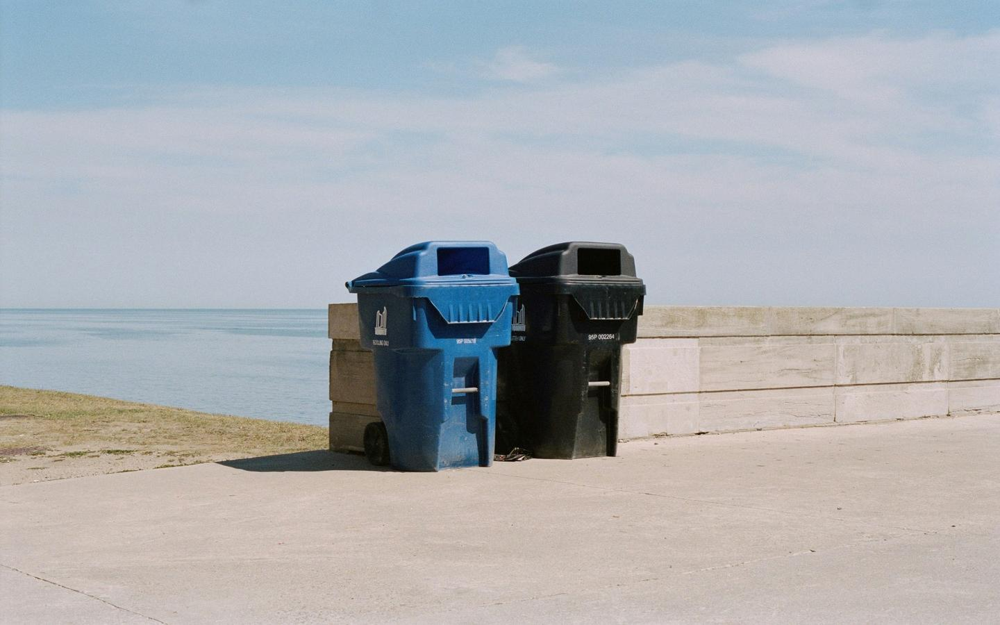

Company:

Employees

Industry:

Get actionable insights on your IT strategy at no cost and no contracts, just free value.

[Schedule](https://blacklineit.com/contact/)

Over a Decade of Trust: How VIM Recyclers Transformed IT into a Strategic Asset

VIM Recyclers is a leader in the environmental services sector, specializing in general waste recycling—including liquids, expired foods, high-quality plastics, metals, and paper. With a workforce spanning both office and warehouse environments, VIM’s operations rely heavily on reliable IT infrastructure and data access to support their ERP-driven workflows and sustainability initiatives.

### **The Problem**

Before partnering with Blackline, VIM’s IT environment was plagued by inefficiency and instability. Their former provider, a one-person operation, struggled to meet the technical demands of the business and frequently left issues unresolved. Communication was poor, charges were opaque, and critical systems like data backup were either mismanaged or missing altogether.

As VIM prepared to adopt a new ERP system, the cracks in their existing IT infrastructure became even more apparent. The aging network couldn't support the data throughput and integration demands of the new platform, putting both growth and operational visibility at risk.

 

**Risks Identified:**

- Inadequate data backup solutions, threatening business continuity
- Outdated and unreliable network infrastructure incompatible with ERP requirements
- Manual processes and data silos slowing down decision-making
- Lack of transparency and accountability from prior IT provider

**What brought Blackline to the table** was VIM’s urgent need for a trustworthy, technically capable partner who could modernize their IT environment, ensure data accessibility, and support digital transformation through long-term collaboration.

> I’ve been particularly impressed with Blackline’s willingness to help out with everything IT and systems related—even when the system in question is not managed by Blackline. They’ve participated in meetings with our third-party software vendors to help figure out any issues or assist with updates, even if our IT infrastructure is not the primary problem.
> 
> **— VIM Leadership**

### **How We Solved It**

We initiated the partnership with our **Apex Innovator Model (AIM)**—a strategic discovery process designed to evaluate the alignment between technology systems and business outcomes. For VIM, this meant assessing their readiness for ERP integration, mapping their infrastructure weaknesses, and identifying manual process bottlenecks ripe for automation.

**Our goal** was twofold: to build an infrastructure that could support modern, scalable ERP workflows and to transform data access and reporting from a reactive process to a real-time asset.

We encountered several **challenges** early on:

- Legacy server environment that lacked virtualization or disaster recovery protocols
- Siloed systems that made reporting across departments labor-intensive
- Manual workflows with redundant data entry causing frequent delays
- Limited internal visibility into IT asset health and performance

We delivered a phased modernization plan, aligning infrastructure upgrades with ERP go-live milestones while ensuring business continuity. Simultaneously, our Software Development team began integrating ERP components to unify workflows and unlock real-time data visibility.

Blackline deployed a fully **virtualized server infrastructure** supported by a **high-availability disaster recovery** solution, minimizing any potential downtime from hardware failure. This future-ready foundation ensured scalability for both users and data.

In parallel, our **Software Development team** engineered custom ERP integrations to centralize data access, automate reporting, and eliminate redundant manual steps. These enhancements drastically improved operational agility, especially for VIM’s sales and executive teams who now rely on real-time dashboards.

Since 2012, Blackline has continued to manage all aspects of VIM’s IT operations—from **workstation and server management** to **helpdesk support** and **IT asset tracking**—serving as an extension of their team and a constant source of innovation and support.

### **The Outcome**

The transformation of VIM’s IT environment has been nothing short of foundational. What began as an urgent infrastructure overhaul evolved into a strategic partnership that now underpins over a decade of growth and digital innovation.

- **Real-time access** to operational and sales data via custom Portal
- **Automated reporting** that previously took weeks now completes in seconds
- **Fully modernized infrastructure** capable of supporting ERP and future systems
- **Ongoing support** across helpdesk, asset management, and software integration
- **Trusted partner engagement** that extends even beyond Blackline-managed systems

 

### Fully modernized infrastructure

 

### Built custom portal to manage data

 

### Automated reporting workflows

### **Value Delivered**

Blackline’s partnership with VIM Recyclers showcases the power of **strategic IT alignment**. By transforming outdated infrastructure and fragmented workflows into a unified, automated, and resilient ecosystem, we’ve enabled VIM to operate with confidence, agility, and clarity.

- **Data confidence** through robust backups and recovery systems
- **Seamless ERP performance** supported by integrated infrastructure
- **Empowered users**, from warehouse staff to the C-suite, with real-time tools
- **A relationship built on trust**, responsiveness, and long-term value

Over a decade later, VIM continues to innovate and grow—backed by a technology foundation that scales with their mission and adapts to new challenges

Get actionable insights on your IT strategy at no cost and no contracts, just free value.

[(630) 388-1700](https://www.google.com/search?q=blacklineit&sca_esv=3cbb991dc4cf362e&sxsrf=AHTn8zr93oVBGw8uyIRQKVxaNC9xrX0emw%3A1741804262300&source=hp&ei=5tLRZ83mD6fnwN4PtpnamAE&iflsig=ACkRmUkAAAAAZ9Hg9tzkHiXLfsrTjDrX-farvUN7sEO5&ved=0ahUKEwjN8cfCloWMAxWnM9AFHbaMFhMQ4dUDCBo&uact=5&oq=blacklineit&gs_lp=Egdnd3Mtd2l6GgIYAiILYmxhY2tsaW5laXQyCxAuGIAEGMcBGK8BMgUQABjvBTIFEAAY7wUyCBAAGIAEGKIESO0eUI8DWN8dcAR4AJABAJgBggKgAbMSqgEFMy41Lja4AQPIAQD4AQGYAhKgAuISqAIKwgIHECMYJxjqAsICDhAuGIAEGLEDGNEDGMcBwgIFEAAYgATCAgsQABiABBixAxiDAcICCBAAGIAEGLEDwgIOEAAYgAQYsQMYgwEYigXCAgsQLhiABBjRAxjHAcICChAjGIAEGCcYigXCAhMQLhiABBjHARgnGIoFGI4FGK8BwgIQEC4YgAQY0QMYxwEYJxiKBcICCxAAGIAEGJECGIoFwgIaEC4YgAQYsQMY0QMY0gMYgwEYxwEYqAMYiwPCAhcQLhiABBixAxjRAxjSAxjHARioAxiLA8ICCBAuGIAEGLEDwgIUEC4YgAQYpgMYxwEYqAMYiwMYrwHCAggQABiABBiLA8ICBxAAGIAEGArCAhQQLhiABBjRAxjSAxjHARioAxiLA8ICDhAuGIAEGMcBGI4FGK8BwgIOEC4YgAQYsQMYgwEYigXCAgUQLhiABMICDhAAGIAEGJECGLEDGIoFwgIREC4YgAQYsQMY0QMYgwEYxwHCAgsQABiABBixAxiLA8ICBxAuGIAEGArCAggQABiiBBiJBZgDA_EF7orAlmDePwSSBwU1LjcuNqAHw7MB&sclient=gws-wiz#)

[Facebook-f](https://www.facebook.com/blacklineit/) [X-twitter](https://x.com/BlacklineIT) [Linkedin-in](https://www.linkedin.com/company/blacklineit) [Instagram](https://www.instagram.com/blacklineit)

[1751 W Diehl Rd Suite 185 Naperville, IL](https://g.co/kgs/kmi23bK)

[171 N Aberdeen St Suite 400 Chicago, IL](https://g.co/kgs/d5JJwPK)

## Get in Touch

Full Name(Required) First

Email(Required)  Message(Required)Please let us know what's on your mind. Have a question for us? Ask away.
